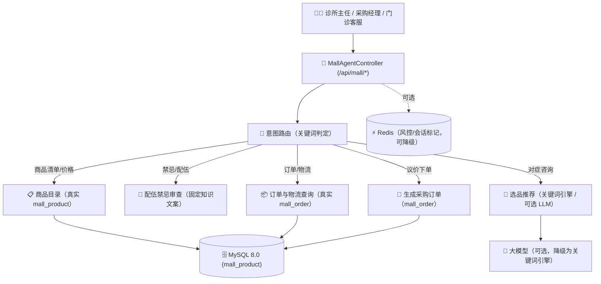

# 春播商城 —— 医药电商运营 Agent（关键词引擎 + 可选 LLM 推荐）

> **项目定位**：集团 B2B 医药控销平台（面向基层诊所、控销公司、分销公司）的电商运营智能体后端。
>
> ⚠️ **实现说明（诚实披露）**：本模块当前为**确定性关键词匹配引擎 + 可选大模型推荐**的混合实现，尚未落地 LangGraph 状态图、RAG 向量检索与秒杀库存锁。以下对照表与架构图以实际代码为准。

---

## 📌 功能与实现对照表

| 功能描述 | 实际落地实现 | 对应代码与实现位置 |
| :--- | :--- | :--- |
| **意图路由（路由→推荐→客服/议价）** | `isDeterministicQuery` + `msg.contains(...)` 关键词分支，按订单/禁忌/清单/运费/对症 5 类路由 | `B2bMultiAgentService.java` |
| **选品推荐** | 关键词 + 同义词匹配引擎 `matchProductsByMessage`；可选 `tryLlmRecommend` 调用大模型返回药品 id 列表，异常自动降级关键词引擎 | `B2bMultiAgentService.java` |
| **面向主任/采购/客服三类角色差异化话术** | 商品档案三个话术字段按角色回显 | `directorPitch`, `buyerPitch`, `csPitch`（`MallProduct.java`） |
| **智能议价与订单落库** | `createOrderFromBargain` 直接按请求金额生成 `mall_order`（当前无阶梯折扣自动核算） | `B2bMultiAgentService.java` |
| **真实 MySQL & Redis 联动** | 控销商品 (`mall_product`)、订单 (`mall_order`) 入库；Redis 用于缓存风控/会话标记（`@Autowired(required=false)`，Redis 不可用时降级） | `chunbo_medical` & Redis |
| **Swagger 契约** | 标准 OpenAPI 3.0 接口定义 | `docs/swagger-apifox.json` |
| **JMeter 压测脚本** | 50 ~ 200 并发阶梯压测脚本 | `jmeter/chunbo_mall_agent_stress_test.jmx` |
| **复盘 SOP** | 上线复盘、缺陷闭环与协同分发质量规范 | `docs/b2b_agent_sop.md` |

---

## 🛠️ 核心架构图（实际实现）

> 说明：`sendRiskNotification`（支付审计工具）当前为**模拟通知**，仅返回提示文本，尚未接入真实企业微信/钉钉 webhook。
