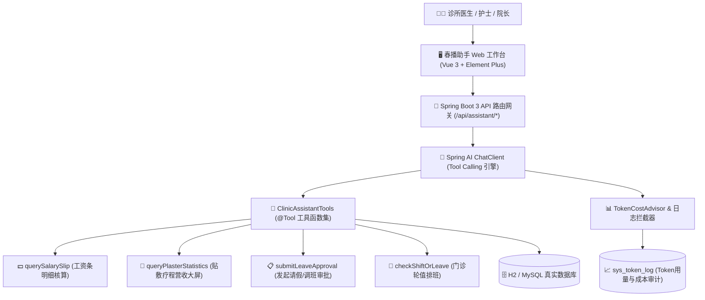

# 春播助手 —— 基于大模型的 OA / 工资条智能体

> **项目定位**：内部运营 SaaS（APP / PC）AI 智能化升级模块，为基层医疗集团与社区门诊打造对话式自动化（查 / 改 / 发）运营中台。

---

## 📌 简历技术点与功能实现全景对照表

| 简历经历描述 | 项目落地实现 | 对应代码与实现位置 |
| :--- | :--- | :--- |
| **SpringAI + Tool Calling 对话封装** | 将“工资条查询”、“贴敷统计”、“OA审批发起”、“排班查询”封装为 Spring AI `@Tool` 工具函数 | `ClinicAssistantTools.java` |
| **任务自主拆解与按步调用** | Agent 根据自然语言自主决定调用单工具或多工具链式组合 | `AssistantController.java` |
| **MyBatis-Plus 领域模型持久化** | 工资条 (`oa_salary_slip`)、贴敷记录 (`oa_plaster_record`)、OA 审批 (`oa_approval`) | `com.chunbo.medical.entity.*` |
| **SimpleLoggerAdvisor 与 Token 成本核算** | 记录单次问答 Prompt/Completion Tokens、网络与推理耗时，折算调用费用（¥）并提供告警与流水审计 | `OaAssistantService.java` & `sys_token_log` |
| **Swagger 契约与 Apifox 对接** | 标准 OpenAPI 3.0 接口定义，涵盖工资、贴敷、审批流与智能体接口契约 | `docs/swagger-apifox.json` |
| **JMeter 阶梯压测脚本与性能分析** | 50 ~ 200 并发阶梯施压、吞吐量 (TPS) 与 P95 响应延迟监控脚本 | `jmeter/chunbo_oa_assistant_stress_test.jmx` |
| **复盘沉淀 SOP** | 测试用例覆盖正向/反向/参数异常、闭环修复与生产上线复盘规范 | `docs/oa_sop_retrospective.md` |

---

## 🛠️ 核心架构图

---

## 📂 目录组织

- `docs/`: 包含 Swagger 3.0 / Apifox 契约文档与上线 SOP 复盘规范
- `jmeter/`: 包含 JMeter 压测脚本，支持阶梯负载、容量验证与稳定性测试